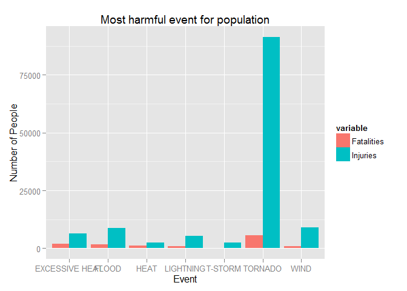
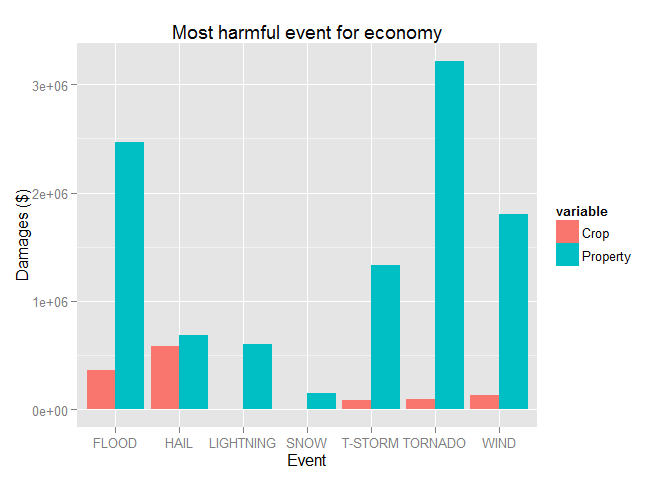

# Storm impact on people health and economy

This report analyse the effects of weather events, as specified by the NOAA, on people health and economic consequences.  
These weather events are listed within the 'evtypes' vector.  
Effects on population health have number of fatalities and injuries as a result of that event.  
Economic consequences have include  size of property and crop damage because of each event.  
In order to find the most harmful events, the 30 largest of each original 'EVTYPE' are found as a total of fatalities and injuries, and each of these events is then assigned to the corresponding NOAA weather event from the 'evtypes' vector.   
The data shown at the end may not reflect exact number of fatalities and injuries, however, as only the smaller events have been left out of this calculation, there should not be a noticeable difference from the true data.   
Finally, two plot are shown - each plot demonstrate impact of various event type on health and economy.

## Data Processing


```r
library(dplyr)
```

```
## 
## Attaching package: 'dplyr'
## 
## The following object is masked from 'package:stats':
## 
##     filter
## 
## The following objects are masked from 'package:base':
## 
##     intersect, setdiff, setequal, union
```

```r
## 
## Attaching package: 'dplyr'
## 
## The following object is masked from 'package:stats':
## 
##     filter
## 
## The following objects are masked from 'package:base':
## 
##     intersect, setdiff, setequal, union
library(ggplot2)
library(reshape2)
```

Read the biz2 file from Blob.  Read vector EVTYPE
Make a vector data_hram that consist of injuries, fatalities
Make a vector data cost that have Property and Crop Damages


```r
download.file("http://nfiecampml.blob.core.windows.net/sample/stormData.csv.bz2", destfile = "data/stormData3b.csv.bz2")
#    bunzip2("data/stormData3b.csv.bz2", overwrite=T, remove=F)
data <- read.csv("data\\stormdata3b.csv.bz2")
##data <- read.csv("C:\\Azure\\data\\stormdata.csv.bz2")
##data <- read.csv("http://nfiecampml.blob.core.windows.net/sample/stormData.csv.bz2")

data$NEWEVENT <- as.vector(data$EVTYPE)

initstrings <- c("tornado", "tstm", "thund", "^summary", "flood", "fld", "wint", "lightning", "^drought", "^heat", "astro", "^record", "snow", "fire", "hail", "smoke", "hurricane", "typhoon", "chill", "funnel", "surf", "^monthly")    
changestrings <- c("TORNADO", "T-STORM", "T-STORM",  "NONE", "FLOOD", "FLOOD", "WINTER WEATHER", "LIGHTNING", "DROUGHT", "HEAT", "TIDE", "NONE", "SNOW", "WILDFIRE", "HAIL", "SMOKE", "HURRICAN", "HURRICANE", "WIND CHILL", "FUNNEL CLOUD", "HIGH SURF", "NONE")

for (i in 1:length(initstrings)) {
    instring <- initstrings[i]
    newstring <- changestrings[i]
    data$NEWEVENT[grep(instring, data$EVTYPE, ignore.case=TRUE)] <- newstring
}


wind <- grep("Wind", data$EVTYPE, ignore.case=TRUE)
notchill <- grep("chill", data$EVTYPE, ignore.case=TRUE, invert=TRUE)
notthunder <- grep("thund", data$EVTYPE, ignore.case=TRUE, invert=TRUE)
data$NEWEVENT[intersect(intersect(wind, notchill), notthunder)] <- "WIND"

data$NEWEVENT <- toupper(data$NEWEVENT)
eventnames <- sort(unique(data$NEWEVENT))
numevents <- table(data$NEWEVENT)
```

Calculate Fatalities


```r
deathsbyevent <- aggregate(data$FATALITIES, by=list(data$NEWEVENT), sum)
names(deathsbyevent) <- c("Event", "Fatalities")
deathsbyevent <- deathsbyevent[order(-deathsbyevent$Fatalities), ]
```

Calculate injuries

```r
injuriesbyevent <- aggregate(data$INJURIES, by=list(data$NEWEVENT), sum)
names(injuriesbyevent) <- c("Event", "Injuries")
injuriesbyevent <- injuriesbyevent[order(-injuriesbyevent$Injuries), ]
```

Combine fatalities + injuries


```r
population_impact_by_event <- merge(deathsbyevent, injuriesbyevent)
population_impact_by_event$Total.Hurt <- population_impact_by_event$Fatalities + population_impact_by_event$Injuries
population_impact_by_event <- population_impact_by_event[order(-population_impact_by_event$Total.Hurt), ]
```

Calcluate property damage

```r
eventbyprop <- aggregate(data$PROPDMG, by=list(data$NEWEVENT), sum)
names(eventbyprop) <- c("Event", "Property")
eventbyprop <- eventbyprop[order(-eventbyprop$Property), ]
```

Calculate crop damage

```r
cropsbyevent <- aggregate(data$CROPDMG, by=list(data$NEWEVENT), sum)
names(cropsbyevent) <- c("Event", "Crop")
cropsbyevent <- cropsbyevent[order(-cropsbyevent$Crop), ]
```

Combine Property and Crop Damages


```r
damagesbyevent <- merge(cropsbyevent, eventbyprop)
damagesbyevent$Total.Damages <- damagesbyevent$Crop + damagesbyevent$Property
damagesbyevent <- damagesbyevent[order(-damagesbyevent$Total.Damages), ]
```


```r
require(reshape2)
## Loading required package: reshape2
population_impact_factors <- melt(head(population_impact_by_event[, 1:3], n=7))
```

```
## Using Event as id variables
```

```r
## Using Event as id variables
economy_impact_factors <- melt(head(damagesbyevent[, 1:3], n=7))
```

```
## Using Event as id variables
```

```r
## Using Event as id variables
```


## Results 

### Q. Across the United States, which types of events (as indicated in the EVTYPE variable) are most harmful with respect to population health?


```r
require(ggplot2)
## Loading required package: ggplot2
qplot(Event, value, geom="bar", data=population_impact_factors, fill=variable, position="dodge", stat="identity", ylab="Number of People", main="Most harmful event for population")
```

 

### Q. 2.Across the United States, which types of events have the greatest economic consequences?


```r
require(ggplot2)
## Loading required package: ggplot2
qplot(Event, value, geom="bar", data=economy_impact_factors, fill=variable, position="dodge", stat="identity", ylab="Damages ($)", main="Most harmful event for economy")
```

 


